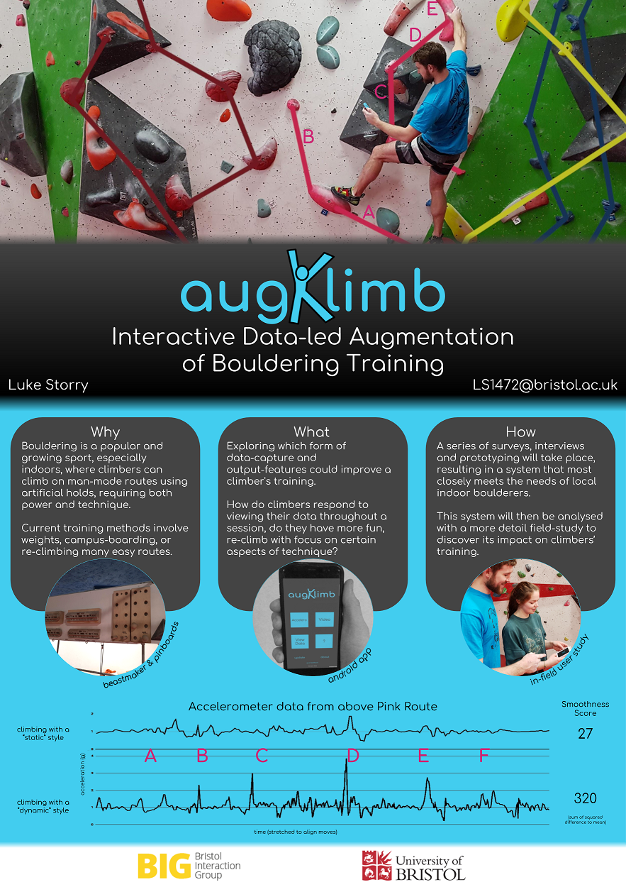

### Bouldering app developed as part of my CS Masters dissertation.

---

---

Simply activate the accelerometer recorder, put your phone in your pocket or chalkbag, and climb!
View analytics about your climb, and (optionally) match it to a video recording for frame-by-frame playback matched with your acceleration.

---

Please email LS14172@bristol.ac.uk if you want to take part in the study, otherwise you are still free to use the app if you wish, do please let me know if you have any suggestions for improvements!

---

### Nightly Android App (Unstable cutting-edge version)  

---

